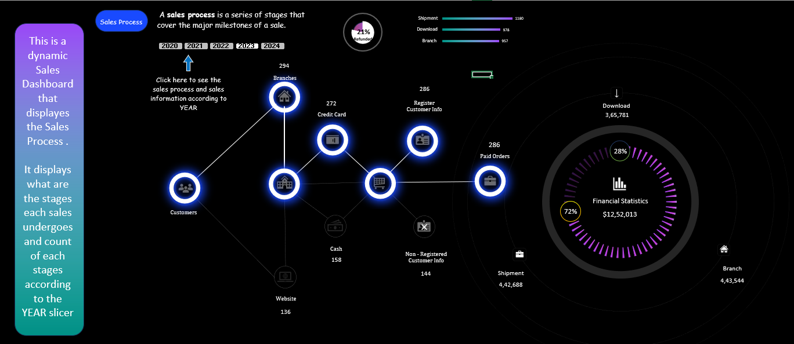

### 1. **Excel Dashboard: Sales Dashboard**

   

   
   - **AIM:** 
     To make a special dashboard in Excel that helps the sales team see and understand sales in a better way. The dashboard includes a slicer tool, which allows users to filter the sales data based on different categories. This feature makes it easy to see the number of sales in a particular section during a selected year. The main objectives are to:
     - Simplify sales data visualization.
     - Improve sales tracking.
     - Assist the team in making informed decisions using the data.

   - **Introduction:**
     The sales dataset used for this dashboard was sourced from the Power BI website. It contains several columns, including:
     - **Order Number**
     - **Year**
     - **Month**
     - **Point of Sale (POS)**
     - **Payment Method**
     - **Assembly Stage**
     - **Registration Status**

     This dataset provides a comprehensive view of sales operations, making it an excellent resource for analysis and visualization. The rich dimensions and metrics of the dataset allow for a well-structured Excel dashboard, where users can filter the data by time, payment method, and assembly stage to gain insights into sales performance, areas for improvement, and whether sales targets are being met.

   - **Key Features:**
     - **Interactive Slicer Tool:** Enables users to filter the sales data based on various dimensions such as time period, payment method, and assembly stage.
     - **Sales Breakdown:** The dashboard shows how sales are distributed across different categories in the selected year.

   - **Conclusion:**
     In completing this sales dashboard project, I have gained valuable insights into data visualization, analysis, and the practical application of Excel tools. This project was a real-world application of skills relevant across various industries.

     The interactive nature of the dashboard, especially the slicers, allows users to explore sales data effortlessly, making it a powerful tool for decision-making and performance evaluation. I have learned not only the technical aspects of dashboard creation but also the importance of clear and user-friendly data presentation in data-driven decision-making.

     This project has deepened my understanding of the power of data visualization and its role in informed decision-making. The ability to turn raw data into actionable insights is a crucial skill that will continue to benefit me throughout my academic and professional journey.

     

