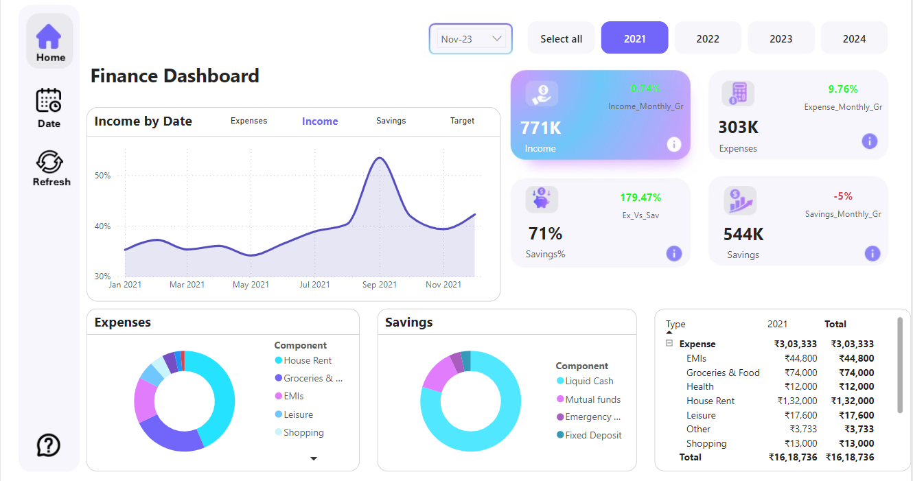

### 3. **Power BI Dashboard: Finance Dashboard**

   - **AIM:** 
     The aim of this project was to analyze a financial dataset using Power BI. The project involved data preprocessing, analysis, and creating an interactive dashboard that presents the findings in a user-friendly format.

   - **Project Phases:**
     1. **Data Preprocessing:** 
        - **Data Cleaning:** Identified and removed inconsistencies like duplicates and incorrect entries to ensure data accuracy.
        - **Data Validation:** Implemented rules to maintain data integrity, including ensuring correct data types (numeric, date), valid numeric ranges, and consistent category names.

     2. **Data Analysis Using Power BI:** 
        Power BI’s tools were leveraged to analyze the financial data:
        - **Income, Expenses, and Savings Overview:** 
          - **Objective:** Provide a comprehensive view of income, expenses, and savings over time.
          - **Method:** Used line and bar charts to visualize monthly trends.
          - **Outcome:** Identified key patterns, including periods of high and low expenses.
        - **Component Analysis:** 
          - **Objective:** Break down expenses and savings into components.
          - **Method:** Displayed component distribution using pie charts.
          - **Outcome:** Provided insights into the major contributors to overall expenses and savings.
        - **Yearly Financial Comparison:** 
          - **Objective:** Compare financial performance across different years.
          - **Method:** Created summary tables and visualizations comparing key metrics across years.
          - **Outcome:** Highlighted financial growth or decline, supporting strategic planning.

     3. **Dashboard Creation:** 
        The interactive dashboard provided a detailed view of the financial data:
        - **Key Metrics:** Displayed total income (3M), total expenses (1M), and total savings (2M) prominently using cards and KPI visuals.
        - **Expenses by Date:** Visualized monthly expenses using a line chart for trend analysis.
        - **Component Distribution:** Pie charts displayed the proportion of components like House Rent, EMIs, and Groceries within total expenses and savings.
        - **Yearly Financial Summary:** Summary tables and bar charts showed yearly totals for key financial metrics like expenses and savings.

   - **Key Insights:**
     1. **Monthly Expenses Trend:** 
        - **Finding:** Notable fluctuations in expenses, with a dip observed in mid-2023.
        - **Actionable Insight:** Investigate the reasons for these fluctuations and adjust budgeting strategies accordingly.
     2. **Savings vs. Expenses:** 
        - **Finding:** Achieved a 64% savings rate, indicating effective financial management.
        - **Actionable Insight:** Continue monitoring and optimizing expenses to maintain or improve this savings rate.
     3. **Component Contributions:** 
        - **Finding:** House Rent and Groceries were the largest contributors to overall expenses.
        - **Actionable Insight:** Explore cost-saving measures in these areas to boost savings.
     4. **Yearly Financial Growth:** 
        - **Finding:** Consistent growth in income and savings over the years, with controlled expenses.
        - **Actionable Insight:** Maintain the current financial strategy while identifying areas for further improvement.

   - **Conclusion:**
     The financial dashboard created in Power BI provided a detailed and interactive view of financial performance across multiple years. The insights gained can help optimize personal or organizational financial strategies, enhance budgeting, and improve overall financial health.
    - **Link to Power BI Dashboard:**
     [Power BI Finance Dashboard](https://app.powerbi.com/groups/me/reports/ff149e31-1246-4825-b95a-7c1686f32e8e/35a719e3d074cdb0515c?experience=power-bi)

