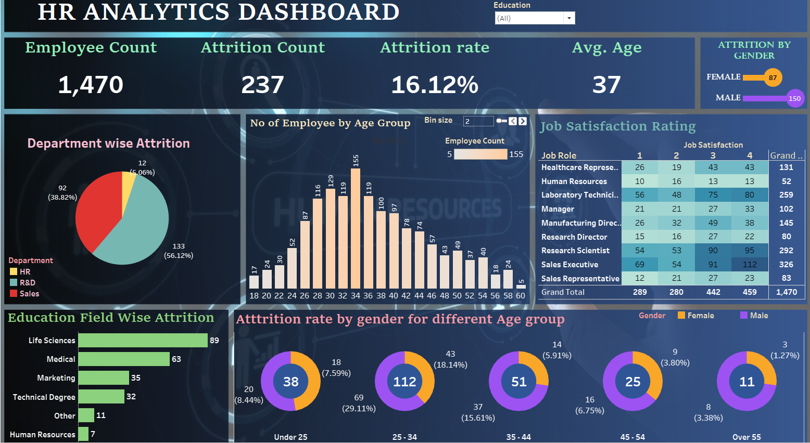

# HR Analytics Dashboard

This dashboard is designed to provide comprehensive insights into various HR metrics, facilitating data-driven decision-making processes for organizational leaders and HR professionals. By leveraging calculated fields and interactive visualizations, this dashboard aims to address key questions related to attrition, workforce demographics, employee satisfaction, and performance within the organization.

## Dataset Overview

The dataset utilized in this dashboard includes the following key columns:

- **Attrition**: Indicates whether an employee has left the company (e.g., "Yes" or "No").
- **Business Travel**: Frequency or type of business travel undertaken by employees.
- **CF_age band**: A calculated field categorizing employees into age bands.
- **CF_attrition label**: A calculated field specifying the attrition status, potentially redundant with the "Attrition" column.
- **Department**: Specifies the department within the company.
- **Education Field**: Field of study or specialization of the employee's education.
- **Employee Number**: A unique identifier for each employee.
- **Gender**: Indicates the gender of the employee.
- **Job Role**: Role or position held by the employee.
- **Marital Status**: Indicates marital status.
- **Over Time**: Specifies if the employee works overtime.
- **Age**: Specifies the age of the employee.
- **Job Satisfaction**: Indicates satisfaction level with their job.
- **Work Life Balance**: Indicates balance between work and personal life.
- **Years At Company**: Number of years the employee has been with the company.
- **Performance Rating**: Indicates the performance rating of the employee.
- **...and more.**

This dataset provides a rich source of information for analyzing various factors related to employee attrition, performance, satisfaction, and demographics.

## Key Findings

### Attrition Analysis
- The dashboard provides insights into attrition counts and rates within the organization.
- Attrition rates are visualized by gender and age groups, offering a deeper understanding of attrition trends.

### Workforce Dynamics
- Charts depict the number of active employees and attrition by gender, enabling a comprehensive view of workforce dynamics.

### Employee Demographics
- Visualizations showcase employee distribution by age, education level, and gender, providing insights into workforce composition.

### Employee Satisfaction and Engagement
- Job satisfaction ratios are highlighted, offering insights into employee engagement levels.
- Attrition rates are analyzed by education field, shedding light on factors influencing attrition.

### Interactive Features
- A bin size parameter for age enables users to dynamically adjust age groupings for analysis.
- Filters on education level allow users to drill down into specific workforce segments.

### Key Performance Indicators (KPIs)
- A dedicated KPI sheet summarizes critical metrics and trends for quick reference.

## Conclusion
This HR analytics dashboard serves as a powerful tool for gaining insights into workforce dynamics, attrition trends, and employee engagement within the organization. By leveraging Tableau's capabilities and calculated fields, stakeholders can make informed decisions to enhance employee retention, optimize workforce management strategies, and foster a more productive and engaged workforce.

